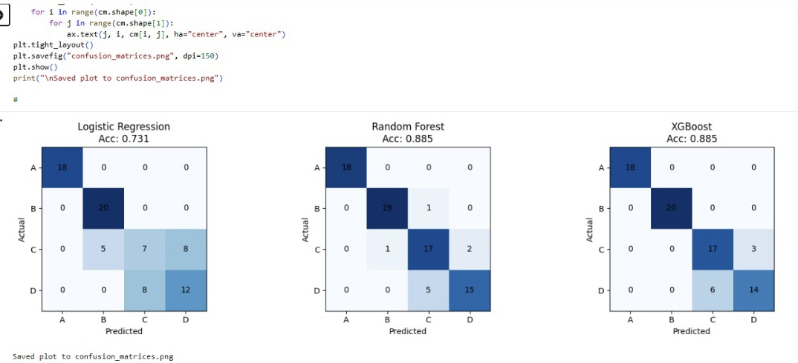
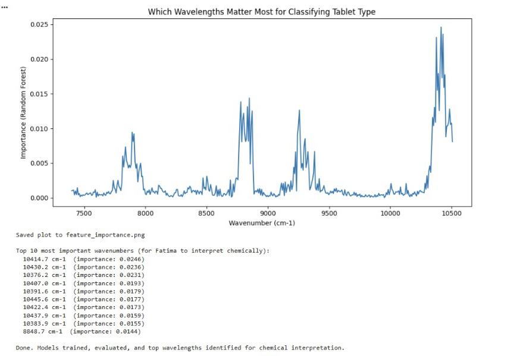

# ML-Based Spectral Pattern Recognition for Pharmaceutical Tablet Classification

**A collaborative project by Anas Ali and Fatima Abbas**
BS Chemistry graduates, University of Punjab, Lahore

## Problem Statement

Verifying pharmaceutical tablet identity, dosage, and quality is traditionally done through slow, destructive wet-chemistry testing. Near-Infrared (NIR) spectroscopy combined with machine learning offers a fast, non-destructive alternative — directly relevant to drug quality assurance in low-resource healthcare settings, including Pakistan, where substandard and counterfeit medicines remain a serious public health concern.

This project explores whether a machine learning model can correctly classify pharmaceutical tablets by type, using only their NIR spectral signature.

## Dataset

- **Source:** University of Copenhagen chemometrics group, publicly available at [models.life.ku.dk/Tablets](http://www.models.life.ku.dk/Tablets)
- **Reference:** Dyrby, M., Engelsen, S.B., Nørgaard, L., Bruhn, M., Lundsberg-Nielsen, L. "Chemometric Quantitation of the Active Substance in a Pharmaceutical Tablet Using Near-Infrared (NIR) Transmittance and NIR FT-Raman Spectra." *Applied Spectroscopy* 56(5): 579-585 (2002).
- **Samples:** 310 tablets across 4 types (A, B, C, D), corresponding to 4 dosage strengths, measured at 3 production scales (laboratory, pilot, full/production)
- **Spectral range:** 404 points, 7398-10507 cm⁻¹ (NIR transmittance)

An important detail from the original study: the 4 tablet types correspond to 4 dosages, but only **2 distinct active-ingredient concentrations** — the lowest dose is formulated differently (5.6% w/w) while the other three share the same relative concentration (8.0% w/w). This becomes directly relevant to our results below.

## Methodology

1. **Preprocessing:** Savitzky-Golay smoothing (window=11, polyorder=2) followed by Standard Normal Variate (SNV) normalization, to remove measurement noise and baseline/scaling variation unrelated to chemical composition
2. **Modeling:** Three classifiers of increasing complexity were trained to predict tablet Type from the processed spectrum:
   - Logistic Regression (linear baseline)
   - Random Forest
   - XGBoost
3. **Evaluation:** Train/test split (75/25, stratified), assessed via accuracy, confusion matrices, and per-class precision/recall
4. **Interpretation:** Random Forest feature importances were extracted to identify which wavelength regions most influenced classification, then cross-referenced against established NIR spectroscopy literature and reviewed for chemical plausibility

## Results

| Model | Accuracy |
|---|---|
| Logistic Regression | 73.1% |
| Random Forest | 88.5% |
| XGBoost | 88.5% |

Both tree-based models substantially outperformed the linear baseline, suggesting the relationship between spectral shape and tablet type is nonlinear — consistent with the physical/chemical nature of NIR absorbance.

**Key finding:** Types A and B were classified almost perfectly, while Types C and D were more frequently confused with one another. This is not a model weakness — it is consistent with the dataset's own documented chemistry: three of the four tablet types share the same relative active-ingredient concentration (8.0% w/w), making their spectral signatures inherently more similar. The model's errors track real chemical similarity rather than random noise, which is itself evidence that it learned a chemically meaningful pattern rather than an arbitrary one.

## Chemical Interpretation of Important Wavelengths

The Random Forest model's most important wavelength regions were cross-checked against NIR spectroscopy reference literature:

| Wavenumber Region | Tentative Assignment | Confidence |
|---|---|---|
| ~7800-7950 cm⁻¹ | C-H / N-H combination bands | Moderate |
| ~8700-8900 cm⁻¹ | C-H second overtone (CH₂/CH₃ groups) | Moderate-High |
| ~9200-9350 cm⁻¹ | Requires further literature verification | Lower |
| ~10350-10500 cm⁻¹ | O-H second overtone (likely water-related) | High |

These assignments were independently reviewed and confirmed by Fatima Abbas against reference NIR spectroscopy sources. The most important region identified by the model (~10350-10500 cm⁻¹) corresponds to a well-documented water-related O-H overtone band, suggesting that moisture content or tablet matrix hydration may be a significant distinguishing factor between tablet types — a plausible and chemically grounded explanation, consistent with known challenges in NIR-based tablet analysis where moisture uptake is a recognized interference factor.

## Division of Contributions

- **Anas Ali:** Data pipeline, preprocessing, model development, evaluation, and feature importance analysis (Python, scikit-learn, XGBoost)
- **Fatima Abbas:** Chemical interpretation and validation of spectral region assignments, cross-referencing model-identified wavelengths against NIR spectroscopy literature

## Limitations and Future Work

- Sample size (310) is modest for a 4-class problem; results should be interpreted as a proof of concept rather than a validated diagnostic tool
- One wavelength region's chemical assignment remains tentative and would benefit from review against a dedicated NIR spectral atlas or the original study's full text
- Future extensions could include: predicting active ingredient percentage directly (regression), anomaly detection for identifying potentially counterfeit/substandard samples, and deployment as an interactive tool for demonstration purposes

## Tools Used

Python, pandas, NumPy, SciPy, scikit-learn, XGBoost, Matplotlib
